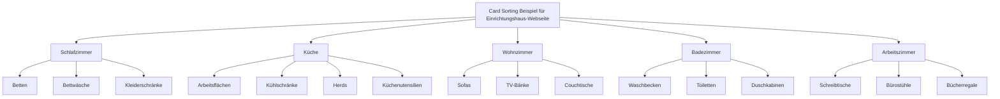

# Card-Sorting

> Eine Methode zum Strukturieren von Information – wie beispielsweise Menüs in
> einer Navigationsstruktur –, bei der Kernbegriffe auf verschiedene Karten
> geschrieben werden und Benutzer aufgefordert werden, diese Karten in Gruppen
> zu sortieren

Es gibt zwei Methoden des Card-Sortings - offen und geschlossen:

## Offenes Card-Sorting

Die Benutzer werden gebeten, die Karten in Gruppen zu
sortieren, die ihrer Meinung nach unterschiedliche Informationsbereiche
repräsentieren.

## Geschlossenes Card-Sorting

Die Anzahl und Bezeichnungen der Gruppen werden vordefiniert - normalerweise
durch eine vorherige Runde offenen Card-Sortings - und die Benutzer werden
aufgefordert, die Karten in diese Gruppen einzuordnen.

## Benennung der Gruppen

Nach einem offenen Card-Sorting werden die Benutzer aufgefordert, jede Gruppe zu
benennen. Wenn die Mehrheit der Benutzer denselben Namen vorschlägt, ist dieser Name
als Gruppentitel zu verwenden.

## Hinweise

Die Gruppen geben wichtige Hinweise darüber, wie man menschzentrierte Menüs
strukturieren und benennen könnte.

- Wenn Benutzer nach der Bedeutung eines Begriffs fragen, erklären Sie es
  ihnen und fragen Sie: „Wie benennen Sie diesen Begriff?“
- Ermutigen Sie die Benutzer, zusätzliche Begriffe hinzuzufügen, die ihnen
  während des Card-Sortings wichtig geworden sind.
  Halten Sie zu diesem Zweck leere Karten bereit.
- Wenn mehrere Benutzer einen Begriff als überflüssig oder irrelevant erachten, sollten
  Sie ihn aus dem Menü entfernen.
  Es stehen verschiedene Tools zur Verfügung, mit denen Sie Card-Sorting-Sitzungen
  vorbereiten, durchführen und analysieren können.

## Beispiel

Ein Beispiel für ein abgeschlossenes Card-Sorting für die Website eines
Einrichtungshauses.

