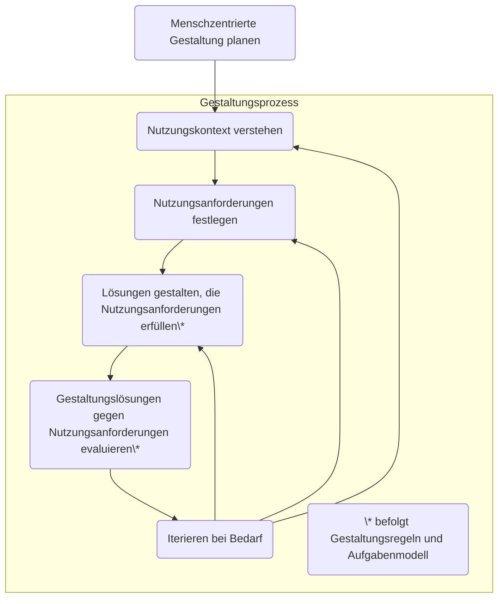

# Der Menschzentrierte Gestaltungsprozess im Überblick

Wir wollen zuverlässig ein gebrauchstaugliches interaktives System mit guter UX gestalten.
Dazu bedarf es bestimmte Aktivitäten im Entwicklungsprojekt.

Diese sind als menschzentrierte Gestaltungsaktivitäten in DIN EN ISO 9241-210 benannt.

Das folgende Flowchart zeigt die fünf Aktivitäten in der richtigen Reihenfolge:

## HCD Deliverables

Nachfolgend ein Überblick, welche HCD-Deliverables vorrangig für das
"Engineering" (Input für Spezifikation und Erstellung) von Gestaltungslösungen
genutzt werden und welche typisch für die Kommunikation von Erkenntnissen
und Ergebnissen im Projektteam und mit Stakeholdern verwendet werden.

### Planung

Für das Engineering:

- Menschzentrierte Aktivitäten im Projektplan
- Menschzentrierte Qualitätsziele

### Nutzungskontext
        
- Nutzungskontextbeschreibung (Oberbegriff)

Für das Engineering:

- Benutzergruppenprofile
- Aufgabenmodelle des gegenwärtigen Nutzungskontextes
- Ist-Szenarien

Für die Kommunikation an Stakeholder:

- Personas
- User Journey Maps des gegenwärtigen Nutzungskontextes

### Nutzungsanforderungen

Für das Engineering:

- Erfordernisse
- Nutzungsanforderungen

### Lösungen

Für das Engineering:

- Nutzungsszenarien
- Aufgabenmodelle für die Gestaltung
- Informationsarchitektur
- Navigationsstruktur
- Styleguide
- Wireframes
- Low-Fidelity-Prototypen
- High-Fidelity-Prototypen

Für die Kommunikation an Stakeholder:

- Storyboards
- User Journey Maps unter Berücksichtigung des interaktiven Systems

### Evaluation

Für das Engineering:

- Usability-Evaluierungsbericht

