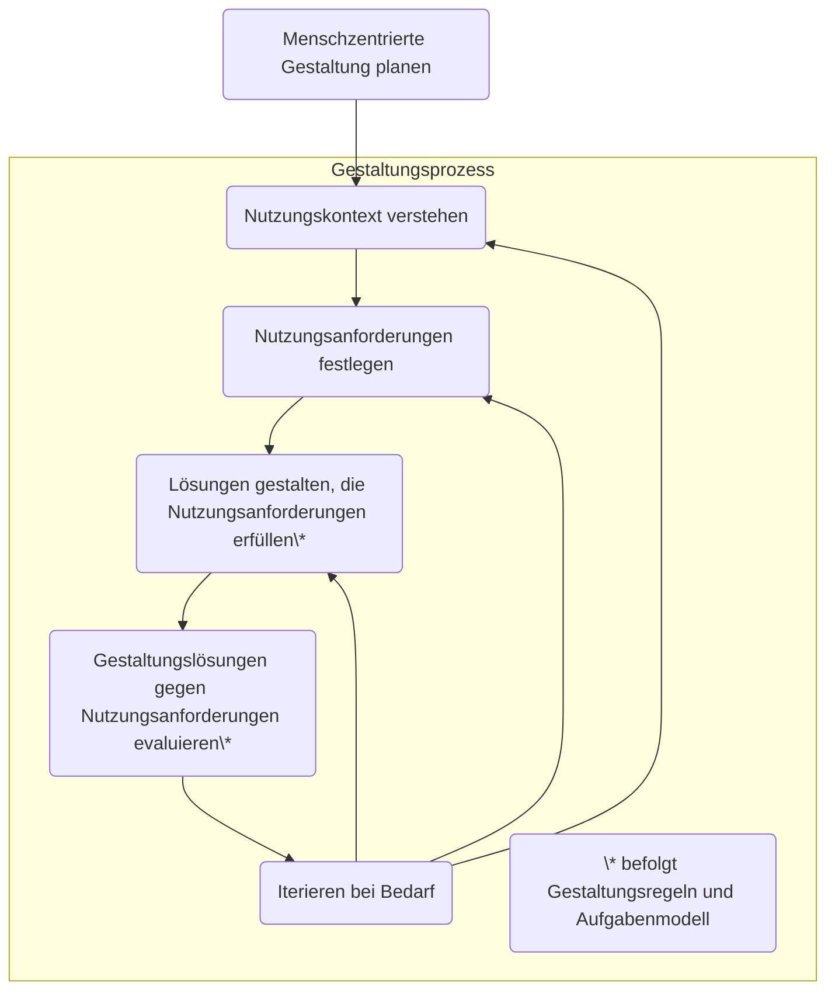

# Der Menschzentrierte Gestaltungsprozess im Überblick

Wir wollen zuverlässig ein gebrauchstaugliches interaktives System mit guter UX gestalten.
Dazu bedarf es bestimmte Aktivitäten im Entwicklungsprojekt.

Diese sind als menschzentrierte Gestaltungsaktivitäten in DIN EN ISO 9241-210 benannt.

Das folgende Flowchart zeigt die fünf Aktivitäten in der richtigen Reihenfolge:

## HCD Deliverables

Nachfolgend ein Überblick, welche HCD-Deliverables vorrangig für das
"Engineering" (Input für Spezifikation und Erstellung von Gestaltungslösungen)
genutzt werden und welche typisch für die Kommunikation von Erkenntnissen
und Ergebnissen im Projektteam und mit Stakeholdern verwendet werden.

| Gestaltungsaktivität | HCD-Deliverables                                     |
|:---------------------|:-----------------------------------------------------|
|Menschzentrierte      | Für das "Engineering":                               |
|Gestaltung planen     | - Menschzentrierte Aktivitäten im Projektplan        |
|                      |   (inkl. menschzentrierte Qualitätsziele)            |
|----------------------|------------------------------------------------------|
