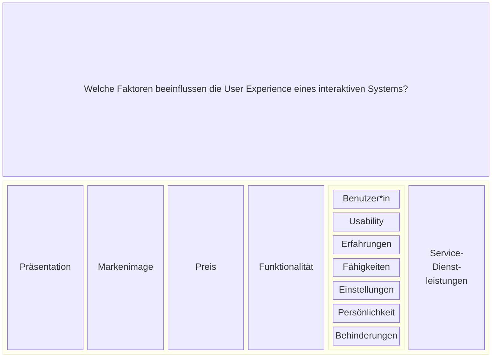

# User Experience

> Die Wahrnehmungen und Reaktionen eines Benutzers, die sich aus der
> tatsächlichen Benutzung und/oder der erwarteten Benutzung eines
> interaktiven Systems ergeben.
>
> Basiswissen Usability und User Experience

User Experience betrachtet die subjektive Sicht des Nutzers auf das interaktive System
einschließlich Erwartungen vor der Benutzung, tatsächliche Benutzung, und nach
der Benutzung
  
Usability betrachtet die tatsächliche Benutzung eines interaktiven Systems aus Benutzersicht,
und wie subjektiv Zufrieden Benutzer während der Benutzung sind.

## Diagramm

Das folgende Diagramm veranschaulicht die Beziehung zwischen User Experience und
Usability.



### Beispiele

- Vorstellungen über ein Produkt, wenn es im Einkaufsregal steht. 
  Weckt gewisse Erwartungen
- Je nachdem, ob die Verpackung für uns ansprechbar ist oder nicht,
  kaufen wir es oder nicht

### Antizipierte Benutzung

- die Zeit vor der Nutzung wird auch "antizipierte Nutzung" genannt
- Hersteller entwickeln zunehmend Möglichkeiten zur antizipierten Nutzung,
  z.B Onlinevideos bis hin zur Möglichkeit etwa eine Brille virtuell anzuprobieren.
- Bewertungen und Social Media Likes, um positive Wahrnehmungen aus der
  tatsächlichen Benutzung weiterzugeben
- User Experience ist meist positiv, wenn die tatsächliche Nutzung die
  Erwartungen aus der antizipierten Nutzung erfüllt
- Das Erlebnis während der Nutzung führt zu Reaktionen nach der Benutzung,
  auch "verarbeitete Nutzung"

### Zufriedenstellung

Das Erlebnis während der Nutzung beeinflusst dann die Zufriedenstellung nach
der Benutzung (mit etwas Abstand, Reflexion)

Arbeitsergebnisse, die aus der Benutzung des Systems entstanden sind,
führen zu weiteren positiven/negativen Erfahrungen, was auch die
Zufriedenstellung des Systems nach der Benutzung beeinflusst.

Die Zufriedenstellung nach der Benutzung beeinflusst die gesamte User Experience.
Sie kann aber auch durch Vorgänge beeinflusst werden, die nichts mit der
Usability zu tun haben.

Beispiele dafür:

- Abgabe der Steuererklärung auf der Webseite des Finanzamts wird umständlich
  wahrgenommen. Nach Reflexion wird klar,dass die Webseite die Abgabe
  der Steuererklärung erleichtert hat. Damit ändert sich die User Experience
  des Benutzers zum Positiven.
- Die Pizzabestellung kann eine super Usability haben,
  aber die User Experience ist schlecht, wenn falsche Beläge geliefert werden.

## Merksatz

Usability betrachtet die Effektivität, Effizienz und Zufriedenstellung bei der
tatsächlichen Nutzung eines Systems.

User Experience betrachtet die subjektiven Wahrnehmungen und Reaktionen des
Benutzers, sowohl vor als auch während und nach der Nutzung.
