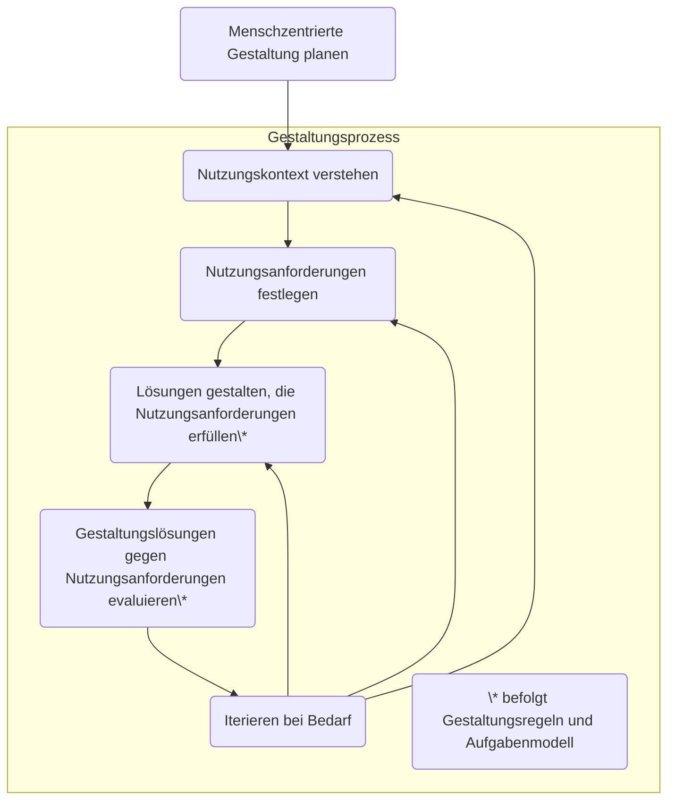

# Der Menschzentrierte Gestaltungsprozess im Überblick

Wir wollen zuverlässig ein gebrauchstaugliches interaktives System mit guter UX gestalten.
Dazu bedarf es bestimmte Aktivitäten im Entwicklungsprojekt.

Diese sind als menschzentrierte Gestaltungsaktivitäten in DIN EN ISO 9241-210 benannt.

Das folgende Flowchart zeigt die fünf Aktivitäten in der richtigen Reihenfolge:

## HCD Deliverables

Nachfolgend ein Überblick, welche HCD-Deliverables vorrangig für das
"Engineering" (Input für Spezifikation und Erstellung) von Gestaltungslösungen
genutzt werden und welche typisch für die Kommunikation von Erkenntnissen
und Ergebnissen im Projektteam und mit Stakeholdern verwendet werden.

<section class="grid">
<section class="card flow" markdown="1">

### Planung

Für das Engineering:

- Menschzentrierte Aktivitäten im Projektplan
- Menschzentrierte Qualitätsziele

</section>
<section class="card flow" markdown="1">

### Nutzungskontext
        
- Nutzungskontextbeschreibung (Oberbegriff)

Für das Engineering:

- Benutzergruppenprofile
- Aufgabenmodelle des gegenwärtigen Nutzungskontextes
- Ist-Szenarien

Für die Kommunikation an Stakeholder:

- Personas
- User Journey Maps des gegenwärtigen Nutzungskontextes

</section>
<section class="card flow" markdown="1">

### Nutzungsanforderungen

Für das Engineering:

- Erfordernisse
- Nutzungsanforderungen

</section>
<section class="card flow" markdown="1">

### Lösungen

Für das Engineering:

- Nutzungsszenarien
- Aufgabenmodelle für die Gestaltung
- Informationsarchitektur
- Navigationsstruktur
- Styleguide
- Wireframes
- Low-Fidelity-Prototypen
- High-Fidelity-Prototypen

Für die Kommunikation an Stakeholder:

- Storyboards
- User Journey Maps unter Berücksichtigung des interaktiven Systems

</section>
<section class="card flow" markdown="1">

### Evaluation

Für das Engineering:

- Usability-Evaluierungsbericht

</section>
</section>

Es ist nicht zwingend notwendig, im Projekt alle genannten HCD-Deliverables
zu erstellen. Es kann je nach Bedarf sinnvoll sein, sich auf einzelne 
Punkte zu konzentrieren.

Die Zielsetzung hierbei ist, dass die Beteiligten informiert sind, so dass
die Realisierung zielgerichtet erfolgen kann.

Projekte beginnen nicht notwendigerweise immer mit 
"Den Nutzungskontext verstehen und festlegen".

Abhängig von der Ausgangssituation, der Zielsetzung für das Projekt und dem
vorhandenen Wissen im Projektteam kann das Projekt mit einer anderen 
Gestaltungsaktivität beginnen.

Beispiele:

- Ein Projektteam hat tiefes Wissen über den Nutzungskontext, aber keinen 
  Konsens über die hierfür passende Lösung. Deshalb beginnt das Projekt mit
  der Spezifikation von Nutzungsanforderungen an die Gestaltungslösung
  und verankert diese in den Aufgabenmodellen der Aufgaben der Benutzer,
  um sinnvolle Gestaltungslösungen zu erzeugen
- Ein Projektteam hat ein interaktives System, das alle relevanten Aufgaben
  der Benutzer unterstützt. Es wurde jedoch mit wenig Wissen über 
  Interaktionsprinzipien und Gestaltungsregeln entwickelt.
  Unter Zuhilfenahme eines UX-Professionals soll ein Redesign des 
  User-Interfaces erfolgen. Hierzu werden zunächst Nutzungsszenarien für 
  jede unterstützte Aufgabe spezifiziert und ein Low-Fidelity-Prototyp
  entwickelt.
- Ein Projektteam hat ein bestehendes interaktives System, mit dem alle
  Benutzer unzufrieden sind. Das Team evaluiert das interaktive System au
  Benutzersicht im Rahmen einer Benutzerbefragung. So werden wiederkehrende
  Usability-Probleme identifiziert. So kann geplant werden, was nächste 
  sinnvolle Aktivitäten sind

Grundsätzlich geht die Denkrichtung immer vom Nutzungskontext, den 
Erfordernissen der Benutzer und den Nutzungsanforderungen aus hin zur 
passenden Gestaltungslösung.

Die Projektrichtung wiederum ordnet sich in den gegebenen Projektbedingungen 
unter (Ausgangssituation, Projektziel, vorhandenes Wissen im Team).

