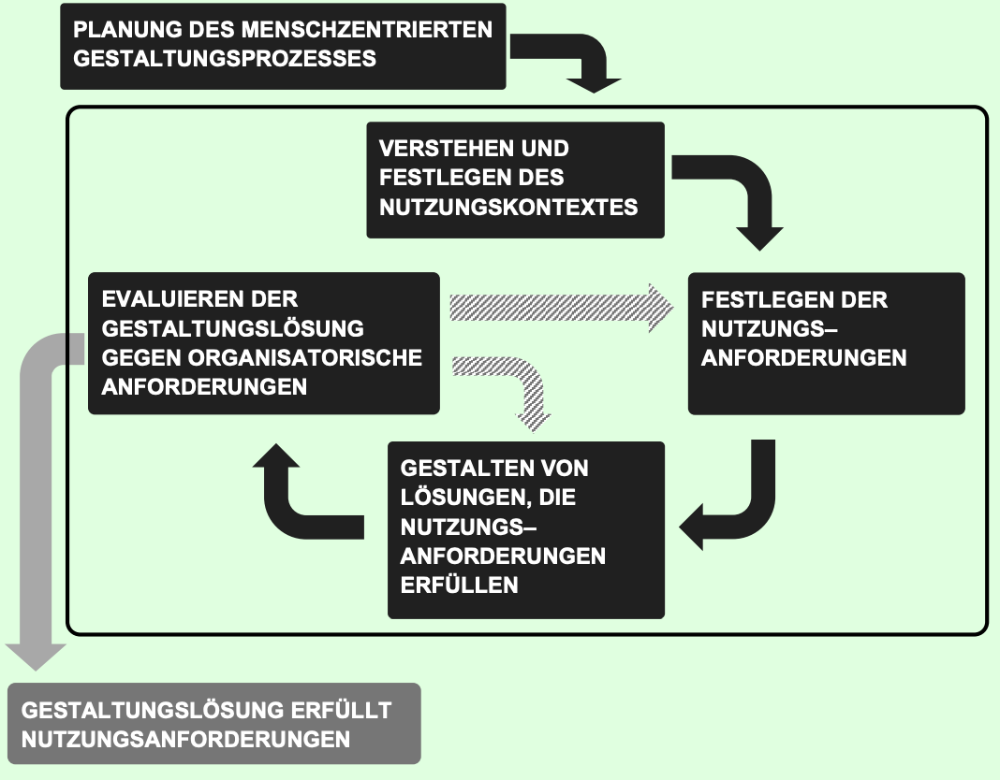
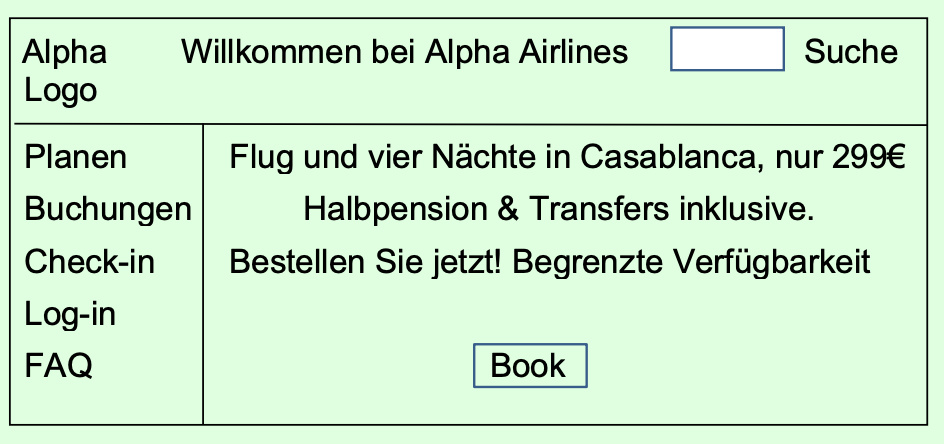

# Prüfungsfragen

1:1 übernommen von den offiziellen öffentlichen Prüfungsfragen.

## Frage 1 (1 richtige Antwort)

Welcher der folgenden Aspekte ist Bestandteil der menschzentrierten Gestaltung?

- [ ] A. Engagement des Managements für Usability und menschzentrierte Gestaltung
- [ ] B. Interesse des Managements an Innovationen
- [ ] C. Die Analyse von Konkurrenzprodukten, um mögliche Fallstricke zu verstehen
- [ ] D. Die Einbeziehung der Benutzer während des gesamten Gestaltungsprozesses
- [ ] E. Regelmäßige Vorführungen des entstehenden interaktiven Systems vor Benutzern
- [ ] F. Genaue Zeitpläne zur Erreichung von Usability-Meilensteinen,
         sodass der Fortschritt überwacht werden kann



## Frage 2 (2 richtige Antworten)

Die folgende Abbildung zeigt den Zusammenhang zwischen den
Aktivitäten der menschzentrierten Gestaltung.

Welche zwei Fehler sind in der Abbildung enthalten?

- [ ] A. Die Aktivität „Management stimmt den Nutzungsanforderungen zu“
fehlt.
- [ ] B. Die Aktivität „Prototypen erstellen“ fehlt.
- [ ] C. Die Aktivität „Festlegen von menschzentrierten Funktionen“ fehlt.
- [ ] D. Statt „Festlegen der Nutzungsanforderungen“ sollte in der
entsprechenden Aktivität „Festlegen der Nutzungsanforderungen,
die den Nutzungskontext erfüllen” stehen.
- [ ] E. Es fehlt einer der grau schraffierten Pfeile, der eine Iteration
kennzeichnen.
- [ ] F. Die Aktivität „Evaluieren der Gestaltungslösung gegen
organisatorische Anforderungen” sollte „Evaluieren der
Gestaltungslösung gegen Nutzungsanforderungen“ lauten.



## Frage 3 (2 richtige Antworten)

Welche zwei der folgenden HCD-Ergebnisse werden während der
Aktivität "Verstehen und Festlegen des Nutzungskontextes"
erzeugt?

- [ ] A. Erfordernisse
- [ ] B. Usability-Testbericht
- [ ] C. Personas
- [ ] D. Ist-Szenarien
- [ ] E. Nutzungsanforderungen
- [ ] F. Low-Fidelity-Prototyp



## Frage 4 (1 richtige Antwort)

Eine Hotelbuchungs-Website bietet den Benutzern keine Möglichkeit,
eine Reservierung zu stornieren. Eine Analyse des Nutzungskontextes
zeigt aber, dass Benutzer diese Funktion benötigen.

Welcher eine Aspekt der Usability wird von dieser Website verletzt?

- [ ] A. Barrierefreiheit
- [ ] B. Vollständigkeit
- [ ] C. Effizienz
- [ ] D. Effektivität
- [ ] E. Zufriedenstellung
- [ ] F. Geschwindigkeit



## Frage 5 (2 richtige Antworten)

Welche zwei der folgenden Antwortmöglichkeiten nennen ein gültiges
Beispiel für die Vermeidung von Schäden durch die Benutzung?

- [ ] A. Der Text auf einer Website ist klein und hat
  einen zu geringen Kontrast zum Hintergrund, so dass Benutzer mit einer
  Sehbehinderung ihn nicht lesen können.
- [ ] B. Das Aussehen und die Qualität der Blumen, die über die Website
  eines Blumenhändlers bestellt wurden, unterscheiden
  sich erheblich von den Bildern auf der Website.
- [ ] C. Im Ausland erhalten die Benutzer eine Nachricht auf ihrem
  Mobiltelefon, die sie über Datenroaming-Gebühren informiert.
- [ ] D. Auf der Website eines Hotels können die Benutzer die Buchung
  eines teuren Hotelzimmers stornieren, aber sie finden nicht heraus,
  wie das geht.
- [ ] E. Die Benutzer geben spontan an, dass ihnen das
  Aussehen der Startseite einer Hotelwebsite nicht gefällt.
- [ ] F. Putzmittelflaschen haben einen Verschluss, 
  den Kinder nicht öffnen können.



## Frage 6 (2 richtige Antworten)

Hinsichtlich der Website einer Fluggesellschaft, welche zwei der
folgenden Aspekte beeinflussen die User Experience, nicht aber die
Usability?

- [ ] A. Die Bilder auf der Website sind ansprechend.
- [ ] B. Die Gepäckkosten bleiben verborgen, bis der Benutzer seinen
  Namen eingegeben hat.
- [ ] C. Es ist möglich, ein Ticket zu stornieren und einen Teil des Geldes
rückerstattet zu bekommen, aber alle Benutzer haben
Schwierigkeiten herauszufinden, wie sie die Rückerstattung
erhalten.
- [ ] D. Die Benutzer empfinden die Preise auf der Website als ziemlich
hoch.
- [ ] E. Die Flughafensuche ist nicht fehlertolerant. Zum Beispiel wird bei
einer Suche nach 'Strassbourg' nicht 'Strasbourg' vorgeschlagen.
- [ ] F. Nach dem Flug ärgern sich die Benutzer über unerwünschte
Marketing-E-Mails der Fluggesellschaft.



## Frage 7 (2 richtige Antworten)

Welche zwei der folgenden Komoponentn sind für den Autofahrer Teil der
Benutzungsschnittstelle des Autos?

- [ ] A. Lenkrad
- [ ] B. Batterie
- [ ] C. Motor
- [ ] D. Türgriff
- [ ] E. Auspuff
- [ ] F. Bremsscheibe



## Frage 8 (1 richtige Antwort)

Welche eine der folgenden Aussagen ist KEIN menschzentriertes Qualitätsziel
für einen Geldautomaten der nächsten Generation?

- [ ] A. Die Benutzer müssen in der Lage sein, Geld doppelt so schnell
wie bisher abzuheben.
- [ ] B. Die Benutzer müssen ein Gefühl der absoluten Privatsphäre
haben, wenn sie den Geldautomaten benutzen.
- [ ] C. Die Benutzer müssen in der Lage sein, den Namen des
Geldautomatenherstellers doppelt so schnell zu erkennen wie
bisher.
- [ ] D. Blinde Benutzer müssen in der Lage sein, ohne fremde Hilfe Geld
abzuheben.
- [ ] E. Die Benutzer müssen in der Lage sein, mit jeder gültigen
nationalen oder internationalen Bankkarte Geld abzuheben.
- [ ] F. Benutzer, die eine Quittung anfordern, müssen diese verstehen
können.



## Frage 9 (1 richtige Antwort)

Welche eine der folgenden Methoden ist NICHT geeignet, um den
Nutzungskontext eines Geldautomaten zu bestimmen?

- [ ] A. Die Idee für den neuen Geldautomaten repräsentativen
Bankkunden zeigen
- [ ] B. Bankangestellte am Bankschalter interviewen
- [ ] C. Benutzer eines aktuellen Geldautomaten interviewen
- [ ] D. Benutzer bei der Nutzung des aktuellen Geldautomaten
beobachten
- [ ] E. Usability-Tests mit Geldautomaten von Wettbewerbern
durchführen
- [ ] F. Durchführung von Fokusgruppen zu Erfordernissen, die
zukünftige Geldautomaten erfüllen müssen



## Frage 10 (1 richtige Antwort)

Thomas arbeitet in einer Bank. Eine seiner Aufgaben ist es, die
Bargeldmenge im Geldautomaten zu kontrollieren und gegebenenfalls
bis zum erforderlichen Stand aufzufüllen. Das macht er jeden Morgen
und freitagnachmittags in Vorbereitung auf das Wochenende.
Welche eine der folgenden Aussagen beschreibt Thomas am besten?

- [ ] A. Thomas ist kein Benutzer des Geldautomaten, da er kein Geld
abhebt.
- [ ] B. Thomas ist primärer Benutzer des Geldautomaten.
- [ ] C. Thomas ist sekundärer Benutzer des Geldautomaten.
- [ ] D. Thomas ist ein indirekter Benutzer des Geldautomaten.
- [ ] E. Thomas ist ein Interessenvertreter für den Geldautomaten, aber
  kein Benutzer.
- [ ] F. Thomas ist Benutzer des Geldautomaten, aber kein
  Interessenvertreter.



## Frage 11 (2 richtige Antworten)

HappyHolidays verkauft über seine Website Pauschalreisen.

Anna bucht auf HappyHolidays.com eine Reise nach Kreta für Bernd
und sich; sie schickt die Bordkarten per E-Mail an Bernd, damit er sie
ausdruckt.

Carolin hat Schwierigkeiten damit, einen Urlaub in Frankreich auf
HappyHolidays.com zu buchen, also ruft sie bei HappyHolidays an und
spricht mit David; David führt sie am Telefon durch den gesamten
Buchungsprozess.

Welche zwei der folgenden Aussagen sind richtig?

- [ ] A. Anna und David sind primäre Benutzer von HappyHolidays.com.
- [ ] B. Bernd ist ein primärer Benutzer von HappyHolidays.com.
- [ ] C. Bernd und David sind sekundäre Benutzer von HappyHolidays.com.
- [ ] D. David ist ein sekundärer Benutzer von HappyHolidays.com.
- [ ] E. Bernd und Carolin sind indirekte Benutzer von HappyHolidays.com.
- [ ] F. Bernd ist ein indirekter Benutzer von HappyHolidays.com.



## Frage 12 (2 richtige Antworten)

Welche zwei der folgenden Personen sind Interessenvertreter, aber
KEINE Benutzer einer Autovermietungs-Website?

- [ ] A. Ein Trainer, der den Mitarbeitern eines Callcenters beibringt, wie
man die Autovermietungs-Website benutzt
- [ ] B. Ein Mitarbeiter des Callcenters, der auf der
  AutovermietungsWebsite für einen Kunden eine Reservierung vornimmt
- [ ] C. Ein Designer, der die Benutzungsschnittstelle der
  Autovermietungs-Website gestaltet
- [ ] D. Ein Kontoadministrator, der eine E-Mail-Rechnung für
  eine Reservierung auf der Autovermietungs-Website bekommt
- [ ] E. Ein Kunde, der über einen Mitarbeiter im Callcenter eine
  Reservierung auf der Autovermietungs-Website vornehmen lässt
- [ ] F. Ein Mitarbeiter im Marketing, der über die Autovermietungs-Website
  eine Werbeaktion mit „10 % Rabatt auf die Kfz-Versicherung” laufen lässt,
  die für alle Benutzer gilt, die direkt über die Website ein Auto reservieren



## Frage 13 (1 richtige Antwort)

Welche eine der folgenden Aussagen beschreibt eine Benutzergruppe
am besten?

- [ ] A. Eine Gruppe von Benutzern mit denselben oder ähnlichen
Personenmerkmalen und Nutzungskontexten in Bezug auf das
interaktive System
- [ ] B. Fünf bis zehn Benutzer, die an kontextuellen Interviews
teilnehmen
- [ ] C. Eine Gruppe von Teilnehmern eines Usability-Tests, deren
Personenmerkmale und Nutzungskontext ähnlich oder identisch
bezüglich des interaktiven Systems sind
- [ ] D. Eine Gruppe von Teilnehmern an einer Fokusgruppe, deren
Personenmerkmale und Nutzungskontext ähnlich oder identisch
bezüglich des interaktiven Systems sind
- [ ] E. Eine Beschreibung einer fiktiven, aber realistischen Gruppe von
Benutzern und was sie bei der Benutzung eines interaktiven
Systems zu tun beabsichtigen
- [ ] F. Eine Beschreibung einer Gruppe von Benutzern und was sie bei
der Benutzung des interaktiven Systems tun möchten



## Frage 14 (2 richtige Antworten)

Welche zwei der folgenden Aussagen beschreiben am besten, warum
es wichtig ist, zwischen Aufgaben und Teilaufgaben zu unterscheiden?

- [ ] A. Aufgaben sind für primäre Benutzer und Teilaufgaben sind für
sekundäre und indirekte Benutzer.
- [ ] B. Dem Meister-Schüler-Modell zufolge sind Aufgaben für den
Meister und Teilaufgaben für den Schüler.
- [ ] C. Aufgaben können zur Erstellung von Usability-Testaufgaben
verwendet werden; Teilaufgaben sollten als Grundlage für
Usability-Testaufgaben vermieden werden, da sie für sich
genommen keinen Wert besitzen.
- [ ] D. Aufgaben bilden die Grundlage für Nutzungsszenarien, während
Teilaufgaben die Grundlage für Aufgabenmodelle sind.
- [ ] E. Aufgaben werden verwendet, um Erfordernisse abzuleiten.
Sowohl Aufgaben als auch Teilaufgaben werden zur Ableitung
von Nutzungsanforderungen verwendet.
- [ ] F. Beim Festlegen einer Interaktion, die eine Aufgabe unterstützt,
müssen alle Teilaufgaben, die für die Erledigung dieser Aufgabe
wichtig sind, berücksichtigt werden.



## Frage 15 (2 richtige Antworten)

Welche zwei der folgenden Fragen sind am besten geeignet, wenn
eine Benutzerbefragung verwendet wird, um den Nutzungskontext
einer Hotelbuchungs-Website zu verstehen?

- [ ] A. Was erwarten Sie von einer Hotelbuchungs-Website?
- [ ] B. Wie zufrieden sind Sie mit der neuen Buchungswebsite für das
-Hotel Zeta in Brüssel?
- [ ] C. Wie beurteilen Sie die Aussage: „Die neue HotelbuchungsWebsite sieht
  gut aus“?
- [ ] D. Aus welchem Grund haben Sie zuletzt eine HotelbuchungsWebsite genutzt?
- [ ] E. Wie sind derzeit die finanziellen Aussichten für neue Hotels?
- [ ] F. Wie beurteilen Sie die Aussage: „Die neue Hotelbuchungswebsite
  entspricht meinen Erwartungen“?



## Frage 16 (1 richtige Antwort)

Welche eine der folgenden Aussagen beschreibt den Zweck einer
Fokusgruppe am besten?

- [ ] A. Fokussierte Informationen von einer Gruppe von Benutzern in
einer Usability-Testsitzung sammeln
- [ ] B. Kontextuelle Informationen über die Erfordernisse der Benutzer
sammeln, ohne deren Arbeit zu beeinträchtigen
- [ ] C. Kontextuelle Informationen über die Erfordernisse der Benutzer
sammeln, indem man mit Benutzern spricht und dabei den Fokus
auf eine besondere Benutzergruppe legt
- [ ] D. Ideen für fokussierte Personas und Szenarien durch Befragung
von Mitgliedern einer Benutzergruppe sammeln
- [ ] E. Ein tieferes Verständnis ausgewählter Themen und wichtiger
Fragen des Nutzungskontexts aus verschiedenen Blickwinkeln zu
gewinnen
- [ ] F. Ein interaktives System evaluieren



## Frage 17 (2 richtige Antworten)

Ein Kollege plant Interviews mit den Benutzern eines
Restaurantbewertungssystems. Seine Interview-Checkliste enthält
unter anderem die Frage:
Wie wählen Sie ein Restaurant aus?
Welche zwei der folgenden Begriffe charakterisieren diese
Interviewfrage am besten?

- [ ] A. Geschlossen
- [ ] B. Formativ
- [ ] C. Suggestiv
- [ ] D. Neutral
- [ ] E. Offen
- [ ] F. Summativ



## Frage 18 (2 richtige Antworten)

Welche zwei der folgenden Aussagen sind gültige Ist-Szenarien für
eine bestehende Autovermietungs-Website?

- [ ] A. Rita besucht die Autovermietungswebsite, um einen Kleinwagen
zu mieten. Sie vergleicht die Autos, die an ihren Reisedaten
verfügbar sind und wählt das Auto aus, das ihr am besten gefällt.
Sie reserviert das Auto für die Abholung am Tag vor ihrer Reise.
- [ ] B. Rita besucht die Autovermietungswebsite, um einen Kleinwagen
zu mieten. Ihr ist nicht klar, ob die Autos, die ihr gefallen, an ihren
Reisedaten verfügbar sind. Rita sucht nach einer
Telefonnummer, um mit jemandem von der Autovermietung zu
sprechen, aber sie kann nur einen Chat-Dienst finden, der
momentan offline ist.
- [ ] C. 1. Ermitteln Sie die gewünschte Abfahrtszeit;
  2. Ermitteln Sie die Kosten für jedes verfügbare Fahrzeug;
  3. Wählen Sie ein Fahrzeug (basierend auf Kosten, Größe,
 persönlichen Vorlieben);
  4. Reservieren Sie das Auto;
  5. Holen Sie das Auto ab.
- [ ] D. Bei der Anmietung eines Autos müssen die Kunden wissen,
welche Fahrzeuge zu den von ihnen ausgewählten Terminen
verfügbar sind, damit sie eine gezielte Entscheidung treffen
können.
- [ ] E. Bei der Anmietung eines Autos müssen die Kunden das
gewünschte Datum auswählen können, damit die Website die
verfügbaren Fahrzeuge anzeigen kann.
- [ ] F. Rita kann Auto fahren, besitzt aber kein Auto. Rita besucht am
Wochenende gelegentlich ihren Bruder in Lübeck. Diese Reise
mit dem Zug zu machen, ist ihr zu teuer und die Busfahrt dauert
ihr zu lange. Daher mietet sie normalerweise ein Auto.



## Frage 19 (1 richtige Antwort)

Welcher eine Ausdruck charakterisiert die folgende Beschreibung am
besten?

Elena Herrmann, Personalkoordinatorin, Fluid Pharmaceuticals

Elena ist 35 Jahre alt. Sie teilt sich eine Wohnung mit ihrem Freund,
mit dem sie seit vier Jahren zusammen ist. Die beiden haben keine
Kinder. Elenas Lieblingsbeschäftigungen sind Tangotanzen und das
Zubereiten köstlicher Tapas. Sie hat solide Grundkenntnisse in
Spanisch.

Elena verbringt den größten Teil ihres Tages damit, Formulare zu
bearbeiten, die benötigt werden, um Mitarbeiter in
der Marketingabteilung einzustellen, zu versetzen oder zu entlassen.
Wenn etwas unvollständig oder unklar ist, nimmt sie sich die nötige Zeit,
die Antwort zu finden. Sie ist Expertin für alle relevanten
Formulare und Verfahren.

Elenas Ziele: Karriere im Personalwesen, Exzellenz durch Genauigkeit,
Hilfsbereitschaft, nicht in Rückstand geraten.

- [ ] A. Prototyp
- [ ] B. Persona
- [ ] C. Ist-Szenario
- [ ] D. Nutzungsszenario
- [ ] E. Benutzergruppe
- [ ] F. Benutzergruppenprofil

 

## Frage 20 (2 richtige Antworten)

Welche zwei der folgenden Aussagen über Erfordernisse sind richtig?

- [ ] A. Erfordernisse werden immer aus Sicht des Benutzers formuliert.
- [ ] B. Die Erfordernisse für eine Benutzergruppe können sich von den
Erfordernissen für eine andere Benutzergruppe im gleichen Nutzungskontext unterscheiden.
- [ ] C. Erfordernisse sind Teil der Informationsarchitektur.
- [ ] D. Erfordernisse sind immer quantifiziert.
- [ ] E. Erfordernisse sind identisch mit Benutzerzielen.
- [ ] F. Erfordernisse werden verwendet, um gute Fehlermeldungen zu
formulieren



## Frage 21 (1 richtige Antwort)

Welcher eine der untenstehenden Begriffe beschreibt die folgende
Aussage am besten?

80% der Benutzer, die die Autovermietungs-Website schon mindestens
zweimal genutzt haben, müssen in der Lage sein, am Flughafen
Frankfurt ein Auto für zwei Tage ab morgen 09.00 Uhr zu mieten.
Benutzer müssen die Aufgabe in weniger als 5 Minuten erledigen können.

- [ ] A. Low-Fidelity-Prototyp-Anforderung
- [ ] B. Nutzungsszenario
- [ ] C. Usability-Testaufgabe
- [ ] D. Erfordernis
- [ ] E. Quantitative Nutzungsanforderung
- [ ] F. Qualitative Nutzungsanforderung



## Frage 22 (2 richtige Antworten)

Welche zwei der folgenden Aussagen sind gültige
Nutzungsanforderungen für eine Hotelbuchungs-Website

- [ ] A. Mindestens 80% der Benutzer, die die Website zum ersten Mal
nutzen, müssen in der Lage sein, innerhalb von zehn Minuten ein
Zimmer zu buchen.
- [ ] B. Das Firmenlogo muss in der oberen linken Ecke jeder Website
erscheinen.
- [ ] C. Die Website muss mindestens so gut nutzbar sein, wie die der
zwei stärksten Wettbewerber.
- [ ] D. Die Website muss über ein Hilfesystem verfügen.
- [ ] E. Das Farbschema der Website muss die Standardfarben des
Hotels widerspiegeln.
- [ ] F. Benutzer müssen in der Lage sein, eine Zimmerbuchung zu
stornieren.



## Frage 23 (2 richtige Antworten)

Welche zwei der folgenden Aspekte sind Teil der
Informationsarchitektur?

- [ ] A. Styleguide
- [ ] B. Gestaltungsregeln
- [ ] C. Festlegen des Grafikdesigns
- [ ] D. Die Ausdrücke, die in der Benutzungsschnittstelle für Navigation
und Inhalt verwendet werden
- [ ] E. Wireframes
- [ ] F. Die Struktur der Informationen, die dem Benutzer zur Verfügung
stehen müssen



## Frage 24 (1 richtige Antwort)

Welche eine der folgenden Methoden ist am nützlichsten für die
Entwicklung der Navigationsstruktur einer neuen Website?

- [ ] A. Kontextuelles Interview
- [ ] B. Fokusgruppe
- [ ] C. Usability-Inspektion eines Low-Fidelity-Prototyps
- [ ] D. Usability-Inspektion eines High-Fidelity-Prototyps
- [ ] E. Card-Sorting
- [ ] F. Storyboard



## Frage 25 (1 richtige Antwort)

Welcher eine der folgenden Begriffe beschreibt die untenstehende
Abbildung am besten?

- [ ] A. Design Pattern
- [ ] B. Persona
- [ ] C. Nutzungsszenario
- [ ] D. Styleguide
- [ ] E. Storyboard
- [ ] F. Wireframe



## Frage 26 (1 richtige Antwort)

Für eine interne Demonstration hat einer Ihrer Kollegen ein neues Bestellsystem
auf einigen Blättern Papier skizziert. Jedes Blatt stellt einen

Screen dar. Der Inhalt der Screens ist handgezeichnet und unvollständig.
Ihr Kollege wechselt die Screens, sobald man auf den Button
„klickt“, indem man mit einem Bleistift das Blatt berührt.

Welcher eine der folgenden Begriffe beschreibt diese Sammlung von
Skizzen am besten?

- [ ] A. Gestaltungsregel
- [ ] B. Low-Fidelity-Prototyp
- [ ] C. High-Fidelity-Prototyp
- [ ] D. Wireframe
- [ ] E. Styleguide
- [ ] F. Storyboard



## Frage 27 (2 richtige Antworten)

Welche zwei der folgenden Begriffe sind Interaktionsprinzipien?

- [ ] A. Erwartungskonformität
- [ ] B. Nachhaltigkeit
- [ ] C. Gebrauchstauglichkeit
- [ ] D. Aufgabenangemessenheit
- [ ] E. Vermeidung von Schäden durch die Benutzung
- [ ] F. Barrierefreiheit



## Frage 28 (1 richtige Antwort)

Welche eine der folgenden Aussagen beschreibt den Begriff „mentales
Modell“ am besten?

- [ ] A. Eine Beschreibung eines fiktiven, aber realistischen Benutzers
und was er bei der Verwendung eines interaktiven Systems zu
tun beabsichtigt
- [ ] B. Eine Beschreibung der Teilaufgaben innerhalb einer Aufgabe, die
ausgeführt werden müssen, um die Ziele des Benutzers zu
erreichen
- [ ] C. Der Denkprozess einer Person darüber, wie etwas in der realen
Welt funktioniert
- [ ] D. Ein kostengünstiges, einfaches Modell eines Designs oder
Konzepts, das dazu dient, Rückmeldungen von Benutzern und
anderen Interessenvertretern in frühen Phasen der Entwicklung
einzuholen
- [ ] E. Informationen, die einen Benutzer dabei unterstützen, mit einem
interaktiven System zu interagieren
- [ ] F. Ein Datenmodell, das abbildet, was die Teilnehmer nach einer
Usability-Testsitzung über das interaktive System dachten



## Frage 29 (1 richtige Antwort)

Welche eine der folgenden Aussagen verdeutlicht die Wichtigkeit von
Gestaltungsregeln?

- [ ] A. Gestaltungsregeln sichern die Umsetzung der menschzentrierten
Gestaltung, indem sie primären Benutzern ermöglichen, direkt an
der Gestaltung teilzunehmen.
- [ ] B. Der unspezifische Charakter von Gestaltungsregeln gibt
Designern die Freiheit, User Interface Elemente nach ihrem
Belieben zu implementieren.
- [ ] C. Der spezifische Charakter von Gestaltungsregeln ermöglicht es
Designern, die gleichen User Interface Elemente konsistent zu
implementieren.
- [ ] D. Gestaltungsregeln ermöglichen es Designern, sich Unterschiede
im Aussehen und Verhalten von Benutzungsschnittstellen
innerhalb einer Organisation einfallen zu lassen.
- [ ] E. Gestaltungsregeln zielen in erster Linie darauf ab, die
Verantwortung für die Gestaltung von Benutzungsschnittstellen
auf das gesamte Designteam zu verteilen, anstatt dem User
Interface Designer die alleinige Verantwortung zu überlassen.
- [ ] F. Gestaltungsregeln werden in Usability-Inspektionen verwendet,
um festzustellen, ob ein Design den organisatorischen
Anforderungen entspricht oder nicht.



## Frage 30 (1 richtige Antwort)

Welche eine der folgenden Aussagen beschreibt den Begriff „Design
Pattern” am besten?

- [ ] A. Eine Sammlung von Buttons in verschiedenen Formen und
Farben für die Verwendung auf einer Website
- [ ] B. Eine Sammlung von Personas mit sehr ähnlichen Merkmalen
- [ ] C. Eine Sammlung von Benutzergruppen mit sehr ähnlichen
Merkmalen
- [ ] D. Eine Sammlung von 4 bis 8 Icons, die in einer festen Reihenfolge
auf dem Screen angeordnet sind
- [ ] E. Eine Reihe unterschiedlicher Ansätze zur Lösung einer Aufgabe
in einem gegebenen Nutzungskontext; die Ansätze müssen in
mehreren separaten Usability-Testsitzungen beobachtet worden
sein
- [ ] F. Eine Lösung eines häufig auftretendes Gestaltungsproblems in
einem gegebenen Nutzungskontext, die ein Gestaltungsproblem,
eine allgemeine Lösung und Beispiele für die Anwendung dieser
beschreibt



## Frage 31 (2 richtige Antworten)

Welche zwei der folgenden Methoden werden häufig zur UsabilityEvaluierung eingesetzt?

- [ ] A. Kontextuelles Interview
- [ ] B. Unmoderierter Usability-Test
- [ ] C. Fokusgruppen
- [ ] D. Erstellung von Personas
- [ ] E. Erstellung von Storyboards
- [ ] F. Usability-Inspektion



## Frage 32 (1 richtige Antwort)

Ihr Team ist bereit, eine neue Autovermietungs-Website online zu
stellen. Aufgrund zeitlicher Engpässe konnten während der
Entwicklung der Website keine Usability-Tests durchgeführt werden.
Ihr Vorgesetzter fordert Sie nun auf, einen Usability-Test
durchzuführen. Ihre Teammitglieder stehen Usability skeptisch
gegenüber.

Angenommen, Sie haben keine großen Einschränkungen hinsichtlich
des Budgets, welche eine der folgenden Maßnahmen wäre für das
Projekt am besten?

- [ ] A. Führen Sie einen Usability-Test mit 20 repräsentativen Benutzern
durch. Laden Sie Ihre Teammitglieder zur Beobachtung der
Testsitzungen ein.
- [ ] B. Führen Sie einen Usability-Test mit 5 repräsentativen Benutzern
durch. Beheben Sie die gefundenen Usability-Probleme, bevor
Sie einen weiteren Usability-Test mit 5 anderen repräsentativen
Benutzern durchführen. Laden Sie Ihre Teammitglieder zur
Beobachtung der Testsitzungen ein.
- [ ] C. Führen Sie eine Fokusgruppe mit 10 repräsentativen Benutzern
durch, in der die neue Website vorgestellt und diskutiert wird.
Laden Sie Ihre Teammitglieder zur Beobachtung der
Fokusgruppe ein.
- [ ] D. Führen Sie eine Fokusgruppe mit 4 repräsentativen Benutzern
durch, in der die neue Website vorgestellt und diskutiert wird.
Laden Sie Ihre Teammitglieder zur Beobachtung der
Fokusgruppe ein.
- [ ] E. Bitten Sie jedes Ihrer Teammitglieder, eine Reihe von
repräsentativen Aufgaben auf der Website auszuführen, damit sie
„den Schmerz der Benutzer spüren können“.
- [ ] F. Führen Sie eine Usability-Inspektion der Website durch.



## Frage 33 (1 richtige Antwort)

Welche eine der folgenden Aussagen beschreibt einen Usability-Test
am besten?

- [ ] A. Eine moderierte, problemorientierte Diskussion zwischen
repräsentativen Benutzern
- [ ] B. Ein Experte evaluiert das interaktive System sorgfältig, um
Usability-Probleme aufzudecken.
- [ ] C. Repräsentative Benutzer werden gebeten, ihre Meinung über das
interaktive System zu äußern.
- [ ] D. Repräsentative Benutzer evaluieren das interaktive System
anhand eines Fragebogens.
- [ ] E. Repräsentative Benutzer werden beobachtet, während sie
vorgegebene, repräsentative Aufgaben mit Hilfe des interaktiven
Systems lösen.
- [ ] F. Repräsentative Benutzer testen das interaktive System, um
Fehler und Mängel zu finden.



## Frage 34 (2 richtige Antworten)

Welche zwei der folgenden Aktivitäten gehören zur Vorbereitung oder
Planung eines Usability-Tests?

- [ ] A. Briefing des Usability-Testteilnehmers über das, was während
der Usability-Testsitzung passieren wird
- [ ] B. Erstellen des Usability-Test-Leitfadens
- [ ] C. Durchführen des Pre-Test-Interviews
- [ ] D. Rekrutierung geeigneter Usability-Testteilnehmer
- [ ] E. Verfassen des Usability-Testberichts
- [ ] F. Verfassen des Interview-Leitfadens



## Frage 35 (1 richtige Antwort)

Sie wurden gebeten, einen Usability-Test einer AutovermietungsWebsite durchzuführen.
Welche eine der folgenden Aufgaben ist für den Usability-Test NICHT
geeignet?

- [ ] A. Finden Sie eine Telefonnummer, die Sie anrufen können, um mit
jemandem über Ihren Mietvertrag zu sprechen.
- [ ] B. Sagen Sie mir, was Sie von der Startseite der Website halten.
- [ ] C. Mieten Sie ein Auto, das Ihren Erfordernissen entspricht. Mieten
Sie es von einem Ort aus und für einen Zeitraum, der zu Ihnen
und Ihrem Budget passt.
- [ ] D. Mieten Sie einen Kleinwagen vom Flughafen London Heathrow.
Sie müssen das Auto morgen früh um 9 Uhr abholen und 4 Tage
später mittags am selben Ort zurückgeben.
- [ ] E. Stornieren Sie eine Reservierung, die Sie zuvor getätigt haben.
- [ ] F. Wie hoch ist die Miete eines Navigationssystems?



## Frage 36 (1 richtige Antwort)

Welche eine der folgenden Aussagen beschreibt den Begriff „Post-Test-Interview”
am besten?

- [ ] A. Die Informationen, die der Moderator dem Testteilnehmer vor der
Usability-Testsitzung zur Verfügung stellt
- [ ] B. Das Interview, das stattfindet, bevor der Usability-Testteilnehmer
mit der Durchführung von Usability-Testaufgaben beginnt
- [ ] C. Die Fragen, die der Moderator dem Testteilnehmer während der
Usability-Testsitzung stellt
- [ ] D. Das Interview, das stattfindet, nachdem der Usability-Testteilnehmer
  so viele Usability-Testaufgaben durchgeführt hat, wie es die
Zeit erlaubt
- [ ] E. Die Fragen, die der Moderator den Testteilnehmern etwa eine
Woche nach der Usability-Testsitzung stellt, um ihre langfristige
User Experience zu erfassen
- [ ] F. Die Fragen, die am Ende eines kontextuellen Interviews gestellt
werden



## Frage 37 (1 richtige Antwort)

Sie führen einen Usability-Test einer neuen Autovermietungs-Website
durch.
Welcher eine der folgenden Befunde ist NICHT passend für diesen
Usability-Test?

- [ ] A. Auf der Startseite fehlt ein ‚Reservierung stornieren‘-Button.
- [ ] B. Die animierte Werbung auf der rechten Seite der Startseite hat
mich genervt und abgelenkt.
- [ ] C. Die Mietpreise sind zu hoch.
- [ ] D. Fachbegriffe wie CDW, Collision Damage Waiver, werden gut
erklärt.
- [ ] E. Ich fand es schwierig, die Gesamtkosten für die Miete
herauszufinden.
- [ ] F. Ich konnte nicht herausfinden, ob ich ein Auto in Paris ausleihen
und in Madrid zurückgeben kann.



## Frage 38 (1 richtige Antwort)

Welcher eine der folgenden Begriffe ist KEINE typische Bewertung
eines Usability-Befunds?

- [ ] A. Positiver Befund
- [ ] B. Geringes Problem
- [ ] C. Ernstes Problem
- [ ] D. Kritisches Problem
- [ ] E. Essenzielles Problem (muss unabhängig von den Kosten behoben werden)
- [ ] F. Katastrophales Problem (existenzielle Bedrohung)



## Frage 39 (1 richtige Antwort)

Welche eine der folgenden Aussagen beschreibt eine Usability-Inspektion am besten?

- [ ] A. Ein Treffen, bei dem Designer im Brainstorming Ideen für ein
neues interaktives System entwickeln
- [ ] B. Eine Evaluierung eines Storyboards
- [ ] C. Eine Evaluierung eines interaktiven Systems, bei der Experten
potenzielle Usability-Probleme identifizieren
- [ ] D. Eine fokussierte Diskussion, bei der ein Moderator eine Gruppe
von Teilnehmern durch eine Reihe von Fragen zu einem
bestimmten Thema führt
- [ ] E. Eine Evaluierung, bei der repräsentative Benutzer bestimmte
Aufgaben am interaktiven System ausführen, um UsabilityProbleme zu identifizieren
- [ ] F. Eine Überprüfung (Inspektion) der Ergebnisse eines kontextuellen Interviews

 

## Frage 40 (1 richtige Antwort)

Welche eine der folgenden Aussagen beschreibt am besten, wie
Benutzerbefragungen für die Usability-Evaluierung verwendet werden?

- [ ] A. Die Benutzer werden gebeten, durch Ausfüllen eines
Fragebogens Fakten und Meinungen über ein interaktives
System mitzuteilen.
- [ ] B. Ein oder mehrere Evaluatoren untersuchen oder benutzen ein
interaktives System, um potenzielle Usability-Probleme zu
identifizieren.
- [ ] C. Repräsentative Benutzer führen bestimmte Aufgaben mit dem
interaktiven System aus.
- [ ] D. Ein Moderator stellt ausgewählten Personen Fragen, um ein
tieferes Verständnis für die Usability eines interaktiven Systems
zu gewinnen.
- [ ] E. Die Benutzer werden gebeten, ihre Ergebnisse zu berichten,
nachdem sie das interaktive System etwa 30 Minuten lang
untersucht haben.
- [ ] F. Ein Moderator leitet eine Diskussion zwischen Mitgliedern einer
oder mehrerer Benutzergruppen über vorher festgelegte Fragen
der Usability.

 

[zu den Lösungen mit Erläuiterungen](loesungen-1.md)
